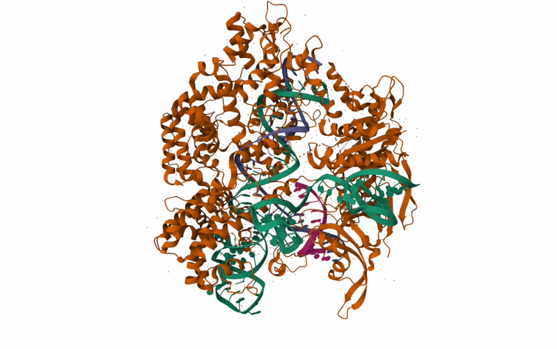

## Protein Information
This protein is a specialized RNA-guided endonuclease enzyme originally derived from Streptococcus pyogenes and found to be a component of its adaptive immune system. This protein acts as      molecular scissors to cut double stranded DA by pairing with synthetic single guide RNA (sgRNA) to form a complex. This complex searches for a valid PAM site which upon correct base-paring,    cleaves the target strand, resulting in an incredibly precise double stranded break.]
## Protein 3D

## Biological Importance of Proper Function
Cas9 is of critical importance, creating a bacteria that’s highly vulnerable to viral destruction if lacking in its presence. When a virus (bacteriophage) attacks the bacterium, the bacterium saves a snippet of the virus in its own genome, a part of their adaptive immune system, and when the same virus invades, it can create a RNA copy that is loaded into the Cas9 protein which eventually destroys the virus.

Consequences of a malfunction in the Cas9 protein via mutation of deletion are immediately apparent, with immune deficiency, bacterial population collapse, and halted evolution to occur. The Cas9 protein is an absolutely critical component of Streptococcus pyogenes. 

Now, this is the coolest part of Cas9 in my opinion, and makes sense of why widespread it is. In fact, taking a recombinant DNA class, we learned all about Cas9 and used it all the time in our labs. So, biotechnology doesn’t care about protect the bacteria, we care about it to exploit that ability of cutting out DNA. Specifically we do this by swapping the natural bacterial sgRNA for a custom sgRNA we design. This allows us to direct the Cas9 to any specific genetic sequence in plants, animals, and humans for editing. 
## Why is it shaped this way?
The 3D structure of Cas9 is made up of many alpha helices and beta sheets, but as expected, also is filled with guide RNA (gRNA), target DNA, and non-target DNA. Describing this protein is a little difficult, but the protein is made up of alpha helices and beta sheets that surround RNA that enters from the top, passes through the middle, leaves at an end. On one end, directly next to the RNA, with only some alpha helices between them, DNA enters this protein and seemingly gets unwound, and bound with the inner RNA, and is shot out of the structure.

There is one binding pocket, with a PrankWeb score of 18.66 and a probability of 0.821, signifying a biological binding pocket at position 938-964. Which double verifies that this protein is either is an enzyme. 
## How do scientists exploit this protein?
Again, scientists exploit this protein by manipulating the sgRNA to direct the Cas9 to any specific genetic sequences. This has an incredible amount of potential, and jumpstarted recombinant DNA research, the art of joining pieces od DNA from different sources, using the Cas9 protein.
## Questions and answers during research
1. What is the difference between endonucleases and regular nucleases? Is it just their local position?
	Endonucleases cut internally within a DNA or RNA strand, while exonucleases cut only from the outside end (3’ or 5’), and connect cut closed, circular pieces of DNA because it would lack 		free ends that it can cut.
2. Why does it only bind to single guide RNA (sgRNA) instead of just gRNA? Is there some compatibility constraint? 
	So, the protein doesn’t only bind to sgRNA, but also crRNA and tracrRNA. cRNA contains 20-nucletides that match the viral target, while tracrRNA acts as the structural scaffolding that 		fits into the grooves of Cas9. 
3. What is a valid PAM site like for the cas9 protein?
	A valid PAM site for wild-type Cas9 is strictly 5’-NGG-3’, a huge constraint, but scientist edit Cas9 with different PAM-interacting domains to recognize sits like 5’-NGA-3’, 5’-NGCG-3’, 		etc. 
