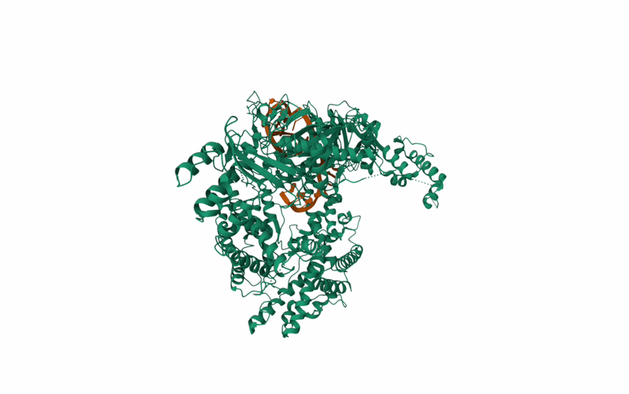

## What is this protein?	
  This protein is a short palindromic repeat that is apart of the adaptive immune system of many bacterial species, mainly anaerobic, that helps provide protection against viruses, transposable elements, and conjugative plasmids.  It works by recognizing a PAM sequence, a 5’ T-rich protospacer adjacent motif (TTTN), on a foreign DNA and once recognized, melts and bends open the double stranded DNA. Following this, Cas12a carries a short piece of CRISPR RNA (crRNA) that contains a 20 nucleotide “space” sequence that if fits perfectly, binds together base-by-base, creating a stable DNA-RNA structure called an R loop. This R-loop then shifts the shape of Cas12a to activate its single catalytic cutting site called a RuvC domain, cutting the two strands of DNA at different positions, unlike Cas9 that cuts across leaving blunt ends. This cutting results in a staggered, sticky end overhand.

  

## Biological Importance of Proper Function
What is this protein's normal job?
	Protection against bacteriophages is the only job in the bacteria, but often  engineering by scientists for gene editing. If this protein is lacking in the bacteria, it completely eliminates the ability to defend itself against bacteriophages unless it also has Cas9 which is incredibly unlikely. Scientists should care about Cas12a because it is far more specific then Cas9 allowing for superior gene insertion, the ability to target regions of the genome Cas9 cant edit, and safer editing away from the target site. Specifically, Cas12a leaves a staggered sticky ends that allows it to be better at inserting  new genes into the genome via Homology directed repair (HDR). Now because Cas12a targets regions rich in thymine (PAM sequence being TTTN), we can successfully target AT-rich regions that Cas9 (PAM sequence being NGG) couldn’t. 

## Why is the SHAPE this way?
This protein is made up of mostly alpha helices riddled throughout its structure, with an occasional beta sheet connecting them together. There is also a crRNA positioned towards the center of the protein with a protruding end on one of its sides. 

There are two chains, chain A being the Cas12a, and chain B, being the crRNA. Chain A is made of 1,305 sequences that is originated from Francisella tularensis subsp. novicida U112. There are 5 domains in Chain A .

Currently prankweb is down so I am unable to check for the biding pockets. 

## How do scientists exploit this protein?
Scientists exploit this protein in all sorts of creative and innovative ways. One of which is using the DETECTR platform which exploits Cas12a trans-cleavage to build diagnostic tests that require no complex lab. This is done by mixing the protein and a guide RNA in a patient’s blood sample, then dropping a synthetic reporter DNA that glows, think of GFP for example, and if the patient has a virus the guide RNA matches, the Cas12 binds, indiscriminately slicing the reporter genes. This results in the reporter genes detaching from their blockers and glowing, allowing the identification of COVIC-19, HPV, and others in a matter of minutes. Other less creative are Multiplexing (Massive parallel gene editing), and knock-ins.

## Questions I still have
Why is it most common is anaerobic bacteria?

  A unique property of anaerobic bacteria is a low GC content, and a rich AT genome. To cut foreign DNA, Cas12a must first recognize a PAM sequence that looks like 5’-TTTN, which is rich in Ts. Another feature of living in these anaerobic environments is having a diverse amount of bacteriophages, explaining why many anaerobes have 

Even with the Cas9 protein, does lacking in the Cas12a result in a complete loss of the adaptive immune system? 
  
  If you have the Cas12a, you are very unlikely to have the Cas9 protein, so only specific bacteria carry Cas9 (Type II CRISPR), while others carry only the Cas12a (Type V CRISPR). So yes, if you are lacking in the Cas12a, you will most likely lose your adaptive immune system as carrying both Cas9 and Cas12a takes up a lot of cellular energy and space. 

When your intentions are to incorporate a foreign DNA into another organism, how to you ensure that its not considered useless baggage like having both Cas9 and Cas12a?
	
  You can use a couple of methods, such as codon optimization, matching the promoters and terminators, evading host defense systems, directing to genomic “safe reasons”,  and metabolic engineering. Scientists run foreign genes through a computer algorithm that allows the DNA letters to match the hosts organisms “dialect” while keeping the protein the same. Now, a gene cannot turn itself on, it requires an upstream promoter and a downstream terminator to work. To fix this issue, you engineer the foreign gene’s to match the native control switches (promoters and terminators). This strips away all foreign control switches and enable highly efficient bacterial promoters, such as tac of T7, to force the machinery to bind and copy the foreign DNA. A very large difficulty is evading the host defense system, so to avoid it, scientists introduce silent mutations into the foreign gene, changing the sequence and allowing it to slip past the host’s defense system unnoticed. If scientist end up randomly inserting the foreign gene, it has a chance to integrate into heterochromatin, silencing the gene, so to avoid this we target open, highly active regions called genomic safe harbors using HDR. Now, we don’t want to leave the foreign DNA to be turned on at maximum volume, so we integrate inducible promoters that switch the foreign gene off while the host cell grows large and healthy in which we add a trigger to flip the switch and activate the protein. 
